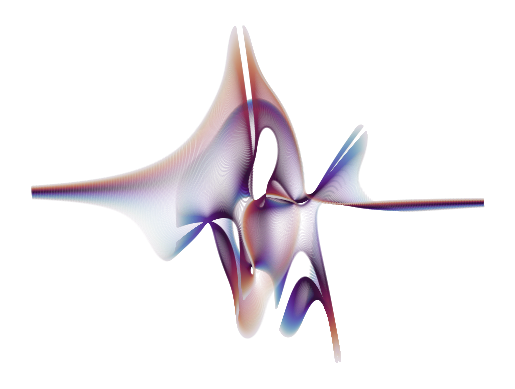

# Eigenvalue Visualizer

Short [Jupyter Notebook](eigenvalues_visualizer.ipynb) to visualize the Eigenvalues of special square matrices

Takes a random `N x N` matrix with two variable elements chosen at random.

Calculates the Eigenvalue of this matrix varying the two variable elements.

Plots the resulting Eigenvalues.

# Possible results

## N = 3

## N = 5

## N = 10

## N = 15

## N = 50

